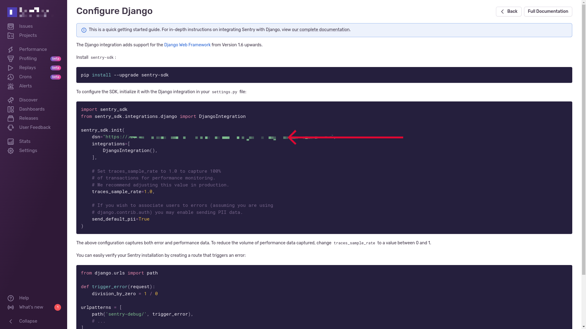

## Deployment
Peachjam can be deployed to a server that has [Dokku](https://dokku.com/) installed. This allows for easy config based deployments using Docker containers.
The following steps outline the procedure to deploy a new Peachjam based application.

#### Application Setup and Configuration
- SSH into the server with dokku installed and create a new application using Dokku's `apps:create` command

      dokku apps:create <app_name>
- Setup the domain for the application

      dokku domains:set <app_name> <domain_name>
- Add the relevant environment variables using the dokku config:set command. The required configuration values can be found in the env.example file.

      dokku config:set CONFIG1=value CONFIG2=value

### Generate Django Secret Key
- To generate the secret key for your application, run:

      dokku config:set <app_name> DJANGO_SECRET_KEY=$(cat /dev/urandom | tr -dc 'a-zA-Z0-9' | fold -w 128 | head -n 1)

#### Sentry Data Source Name (DSN)
A `DSN_KEY` environment variable is required for Sentry to start monitoring events in the application you've just created. To get a dsn value:
- Access your Laws.Africa Sentry account, click on **Projects** then **Create Project**:

  

- Upon creating a new Sentry project, a dsn value will be generated automatically. Copy the value and set it as the `SENTRY_DSN_KEY` environment variable for your dokku application.

  

    dokku config:set <app_name> SENTRY_DSN_KEY=<dsn_value>

## Caveat
- It is necessary to disable checks on the dokku application you've just created to prevent postdeploy checks from failing. This should be re-enabled once the deployment process is completed successfully.

      dokku checks:disable <app_name>

#### Build and Deploy
- Dokku will build and deploy the application automatically on git push. First add the remote to the git

      git remote add dokku-<app_name> dokku@<your_server_domain>:<app_name>

- To trigger a build and deploy:

      git push dokku-<app_name> <branch_name>:master

#### SSL
- Enable LetsEncrypt for SSL/TLS. Dokku allows easy setup of SSL using the letsencrypt plugin. On the server, install the letsencrypt dokku plugin:

      sudo dokku plugin:install https://github.com/dokku/dokku-letsencrypt.git

- Configure letsencrypt with the Laws.Africa techops email address, to get reminders about renewing certificates:

      dokku config:set --no-restart <app_name> DOKKU_LETSENCRYPT_EMAIL=your@email.tld

- Install the certificate. Before you install the certificate, your website's domain name must be setup and pointing at this server, so that you can prove that you own the domain.

      dokku letsencrypt <app_name>

- Letsencrypt certificates expire every three months. Let's setup a cron job to renew certificates automatically:

      dokku letsencrypt:cron-job --add

- You can also manually renew a certificate when it's close to expiry:

      dokku letsencrypt:auto-renew

#### Background Tasks

- Peachjam runs various background tasks as separate processes. They can be specified within the Procfile.
- On the dokku server, scale up the processes to run these tasks:

      dokku ps:scale <app_name> tasks=1

### Languages
### Elasticsearch Index
### NGINX Proxy Read timeout
